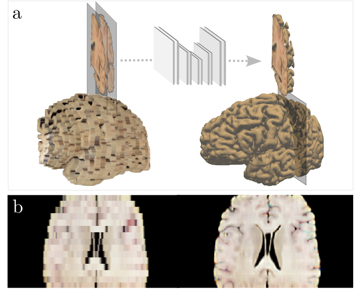

# Improving Neuropathological Reconstruction Fidelity via AI Slice Imputation

A 2D U-Net that imputes intermediate coronal slices to turn anisotropic 3D reconstructions
of dissection photographs into anatomically consistent, near-isotropic volumes. The network
is trained entirely on domain-randomized synthetic data generated on the fly from 1 mm
isotropic MRI, so it generalizes across photograph contrasts and across slab thicknesses that
are not known a priori. This is the imputation step described in *Improving Neuropathological
Reconstruction Fidelity via AI Slice Imputation* (see [References](#references)).

## Overview

Dissection photographs are routinely acquired by brain banks but the slabs are several
millimeters thick, leaving large gaps between slices after 3D reconstruction. This codebase
trains and applies a super-resolution model that fills those gaps: given two acquired coronal
slices that bracket a missing location, plus their distances to it, the model predicts the
slice in between. Applied slice by slice, it reconstructs a high-resolution isotropic volume
suitable for downstream atlas registration, segmentation, and volumetry.


## Repository layout

```
project_root/
├── ext/                      # project utilities
├── generators.py             # synthetic triplet generator (hemi_generator)
└── scripts/
    ├── train.py              # training and validation loops
    ├── sample.py             # inference on a real stack of dissection photographs
    ├── run_imputation.sh     # wrapper: runs sample.py for one subject
    └── run_downstream.sh     # wrapper: surface reconstruction, segmentation + Dice, atlas registration + Dice
```

## Installation
### Environment 
Full instructions are in `SETUP.md`. In brief, on Linux with an NVIDIA GPU:

```bash
python3.11 -m venv ~/envs/photo-imputation && source ~/envs/photo-imputation/bin/activate
pip install --upgrade pip
pip install torch --index-url https://download.pytorch.org/whl/cu121   
pip install -r requirements.txt
```

The PyPI dependencies are `torch`, `numpy`, `nibabel`, `matplotlib`, and `opencv-python`.
A compatible NVIDIA driver is required; a system CUDA toolkit is not, since the PyTorch
wheels bundle their own runtime. `ext`, `unet`, and `generators` come from this repository.

### Additional software
 
The imputation step (`sample.py` / `run_imputation.sh`) needs only the Python environment
above. The downstream evaluation (`run_downstream.sh`) additionally requires the following
neuroimaging packages, each installed separately and exposed on `PATH`:
 
- **FreeSurfer** provides `mri_synthseg` (volume segmentation) and `mri_compute_overlap`
  (Dice and Jaccard overlap). Download and installation:
  https://surfer.nmr.mgh.harvard.edu/fswiki/DownloadAndInstall
- **recon-all-clinical** (cortical surface reconstruction for scans of arbitrary contrast and
  resolution) is documented at https://surfer.nmr.mgh.harvard.edu/fswiki/recon-all-clinical.
  The script invokes a project wrapper named `run_recon-any` (a "Recon-Any" / recon-all-clinical
  build); install it separately and confirm `run_recon-any` is callable.
- **NiftyReg** provides `reg_aladin` (affine) and `reg_f3d` (non-rigid) registration. Source and
  build instructions: https://github.com/KCL-BMEIS/niftyreg

After installation, set up the environment, for example:
 
```bash
export FREESURFER_HOME=/path/to/freesurfer
source "$FREESURFER_HOME/SetUpFreeSurfer.sh"
 
# Expose the NiftyReg binaries (reg_aladin, reg_f3d)
export PATH="/path/to/niftyreg/bin:$PATH"
```
 
Verify the binaries resolve before running the pipeline:
 
```bash
command -v mri_synthseg mri_compute_overlap run_recon-any reg_aladin reg_f3d
```

## Usage

### Training
`train.py` script contains the skeleton of the training scripts used to run the training and validation of the imputation model. 
Configuration is set at the top of `train.py` (data directory, output directory,
device, U-Net width, spacing limits, epochs). 

```bash
python scripts/train.py
```

Checkpoints are written to `output_directory`. Validation uses a fixed synthetic set
materialized once before training and reused every epoch, with the inter-slice spacing fixed at
the midpoint of `spacing_limits` (`mid_loc=True`). 

#### Training Data
Training data was recovered from the following 10 publicly available datasets: ABIDE [28], ADHD200
[29], ADNI [30], AIBL [31], COBRE [32], Chinese-HCP [33], HCP [34], ISBI2015 [35],
MCIC [36], and OASIS3 [37]

### Inference
`sample.py` performs through-plane slice imputation on a 3D brain volume reconstructed from coronal dissection photographs. Given a reconstruction sampled at a coarse slice spacing (the photographed slab thickness), it synthesizes intermediate coronal slices with a pretrained 2D U-Net and writes a denser, near-isotropic volume. The network predicts a residual correction on top of a linear interpolation between the two neighboring acquired slices, conditioned on their relative distances.

Download `model_weights.pth` from: https://ftp.nmr.mgh.harvard.edu/pub/dist/lcnpublic/dist/dissection_photo_model/photo_imputation_unet.pth

#### Input

A 3D volume in NIfTI (`.nii.gz`) or FreeSurfer (`.mgz`) format, produced by the FreeSurfer PhotoTools reconstruction (for example `photo_recon_4mm.nii.gz`). The volume may be grayscale or RGB. After canonical reorientation, the through-plane (coronal) axis is assumed to be axis 1. Anterior and posterior padding is expected to be approximately symmetric; the script raises an exception if uneven padding is detected.

#### Basic command

```bash
python sample.py \
  --model_path /path/to/model_weights.pth \
  --input_file /path/to/photo_recon_<thickness>mm.nii.gz \
  --save_path  /path/to/imputation_<thickness>mm.mgz
```

#### Arguments
 
| Argument | Type | Default | Description |
|---|---|---|---|
| `--model_path` | str | see source | Path to the pretrained U-Net checkpoint (`.pth`). |
| `--input_file` | str | see source | Path to the input reconstruction (`.nii.gz` or `.mgz`). |
| `--save_path` | str | see source | Output file path for the imputed volume (`.mgz` or `.nii.gz`). |
| `--seed` | int | 42 | Random seed. Currently unused. |
| `--num_workers` | int | 4 | Number of CPU threads (passed to `torch.set_num_threads`). |
| `--illumination` | float | None | Reserved for illumination handling. Currently unused. |
| `--unsharp_sigma` | float | 1.0 | Intended Gaussian sigma for unsharp masking. Currently ignored; a fixed value of 1 is applied (see [Known limitations](#known-limitations)). |
| `--unsharp_amount` | float | 1.0 | Intended unsharp amount. Currently ignored; a fixed value of 1 is applied (see [Known limitations](#known-limitations)). |

#### Output

The reconstructed, slice-imputed volume is written to `./photo_recon.imputation.mgz` in the current working directory. The output preserves the corrected affine, rescaled to the denser through-plane spacing, and is stored as `uint8`.
This reads the 4 mm reconstruction, resamples it in plane to 1 mm per pixel, synthesizes intermediate coronal slices to reach approximately 1 mm slice spacing, applies unsharp masking, and writes `photo_recon.imputation.mgz`.


## Reference

The scripts in this repository were used to produce the results reported in the associated manuscript. If you use any of these tools, please cite the following:

- M. Crespo Aguirre, J. Williams-Ramirez, D. Zemlyanker, X. Hu, L. J. Deden-Binder, R. Herisse, M. Montine, T. R. Connors, C. Mount, C. L. MacDonald, C. D. Keene, C. S. Latimer, D. H. Oakley, B. T. Hyman, A. Lawry Aguila, and J. E. Iglesias, "Improving Neuropathological Reconstruction Fidelity via AI Slice Imputation," arXiv:2602.00669, 2026.