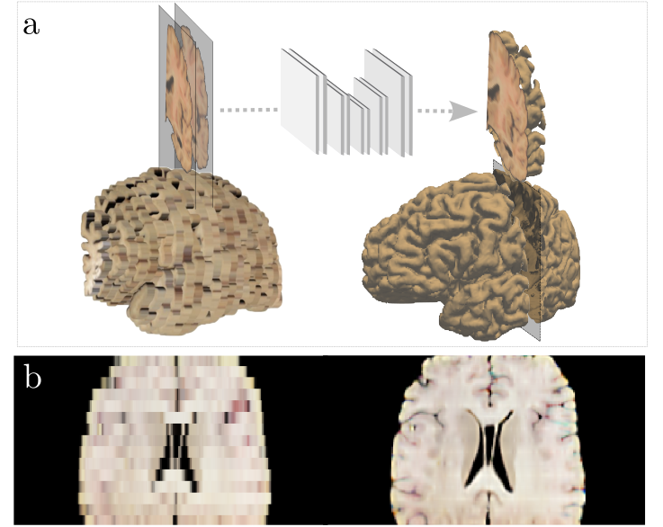

# Photo-recon imputation and evaluation pipeline



This repository contains the training, inference, and evaluation code for a 2D U-Net-based slice imputation pipeline applied to dissection-photo reconstructions. The code on the current main branch focuses on three pieces:

- training a slice-imputation model from synthetic data,
- applying the trained model to reconstructed volumes, and
- running downstream evaluation experiments for consistency, surface reconstruction, segmentation, registration, and volume correlations.

## Repository layout

The files currently available on the remote main branch are:

```text
.
├── bash_scripts/
│   ├── madrc_run_downstream_batch.sh
│   ├── madrc_run_downstream_registration.sh
│   ├── run_imputation.sh
│   └── run_imputation_madrc.sh
├── environment.yml
├── experiments/
│   ├── consistency_experiment.py
│   ├── task_atlas_registration.py
│   ├── task_consistency.py
│   ├── task_surface_reconstruction.py
│   ├── task_synthseg_segmentation.py
│   ├── task_synthseg_segmentation_photosynthseg.py
│   ├── task_volume_segmentation.py
│   ├── volume_correlations.py
│   └── volume_correlations_madrc.py
├── ext/
│   ├── evaluation/
│   ├── unet3d/
│   ├── logger.py
│   ├── machine_learning_utils.py
│   ├── photo_imputation_utils.py
│   ├── photo_utils.py
│   ├── utils.py
│   └── __init__.py
├── generators.py
├── make_videos.py
├── requirements.txt
├── sample_machine_learning.py
├── train.py
└── README.md
```

## Installation

This project is intended for Python 3.11 on Linux with a CUDA-capable GPU.

### Option 1: pip

```bash
python3.11 -m venv ~/envs/photo-imputation
source ~/envs/photo-imputation/bin/activate
pip install --upgrade pip
pip install -r requirements.txt
```

The repository also provides a Conda environment file in `environment.yml`.

### Notes

- PyTorch should be installed with a CUDA-enabled wheel matching your local driver.
- `requirements.txt` contains the non-PyTorch Python dependencies; `environment.yml` is a convenience alternative.
- The repository does not ship a pretrained checkpoint at the root level. A checkpoint path must be supplied by the user when running inference.

## Training

The training entry point is `train.py`.

Before running it, edit the configuration section near the top of the file to point to your training data and output directory:

- `training_data_dir_hemis`
- `output_directory`
- `device_training` and `device_generator`
- `spacing_limits`, `batchsize`, `n_epochs`, and related settings

Then run:

```bash
python train.py
```

The script trains a 2D U-Net using synthetic samples generated by `generators.py` and writes checkpoints to the configured output directory.

## Inference

Inference is implemented in `sample_machine_learning.py`.

Basic usage:

```bash
python sample_machine_learning.py \
  --input_file /path/to/input_volume.nii.gz \
  --save_path /path/to/output_volume.nii.gz \
  --model_path /path/to/model_checkpoint.pth \
  --use_model
```

The script reads a reconstructed volume, resamples it, runs the trained model when `--use_model` is provided, and writes:

- the model-based output at the requested `--save_path`,
- a tricubic version with the suffix `_tricubic.nii.gz`, and
- a trilinear version with the suffix `_trilinear.nii.gz`.

The shell wrappers in `bash_scripts/` provide batch-oriented entry points for repeated runs over local subject directories.

## Downstream experiments

The `experiments/` directory contains scripts for reproducing the analysis workflow used in this project. These are not generic utilities; they assume the local directory structure and output folders used for the UW/MADRC photo-reconstruction cohorts.

Representative scripts include:

- `experiments/task_consistency.py` for consistency-based analyses
- `experiments/task_surface_reconstruction.py` for surface reconstruction metrics
- `experiments/task_synthseg_segmentation.py` and `experiments/task_synthseg_segmentation_photosynthseg.py` for SynthSeg-based overlap analyses
- `experiments/task_atlas_registration.py` for atlas-registration comparisons
- `experiments/task_volume_segmentation.py` for segmentation-based outcomes
- `experiments/volume_correlations.py` and `experiments/volume_correlations_madrc.py` for volume-correlation analyses

Each experiment script should be run from the repository root or adjusted to your local data layout before execution.

## Notes

This README reflects the files present on the current remote main branch. Some paths and wrappers in this repository are intentionally repository-specific and may need to be edited to match your local data layout.
